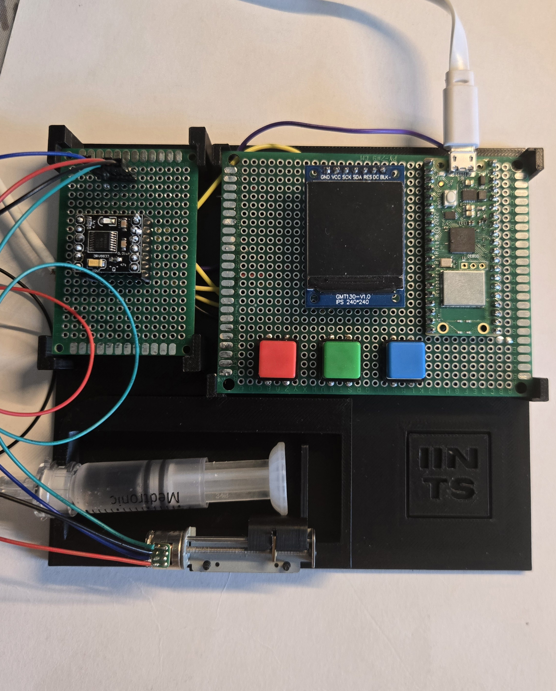

# 🩸 IINTS – Open-Source Insulin Pump for Raspberry Pi Pico  

<div align="center">
  
</div>

**IINTS** (Insuline Is Not The Solution) is an **open-source insulin pump project** designed for affordability and accessibility.  
Built with **MicroPython** on a **Raspberry Pi Pico**, it controls insulin delivery using stepper motors and a user-friendly interface.  

🔹 **Customizable** | 🔹 **Affordable** | 🔹 **Open-Source** | 🔹 **Made for Everyone**  

---

## 🌜 Project History  
IINTS was created in **2024** as a personal project to learn more about insulin pumps and their mechanics. As someone with 13 years of experience living with diabetes, I was curious about how these devices work and wanted to build one myself. While not intended as a commercial alternative, I am sharing this project as an open-source learning experience for anyone interested in electronics, programming, and medical technology.

--- 

<h3>🚀 <strong>Milestones:</strong></h3>
<ul>
  <li>📌 <strong>May 2024</strong> – First working prototype using Raspberry Pi Pico</li>
  <li>📌 <strong>July 2024</strong> – Added OLED display and user interface</li>
  <li>📌 <strong>December 2024</strong> – Introduced microstepping for improved precision</li>
  <li>📌 <strong>April 2025</strong> – Awarded "Most Technically Complex Project" at <strong>Coolest Projects Belgium</strong></li>
  <li>📌 <strong>May 2025</strong> – Named "Student in the Spotlight" for the third time, this year for IINTS!</li>
</ul>

---

💡 **Special Thanks**  

A huge thank you to the **coaches of CoderDojo Genk and Hasselt** for their incredible guidance and support throughout this project. Their mentorship has been invaluable in helping me bring this idea to life! 🙌  

---

## 📌 Features  
✅ **Stepper Motor Control** – Accurate insulin delivery using stepper motors  
✅ **User-Friendly Interface** – Buttons & Display for easy control  
✅ **Safety Mechanisms** – Basic fail-safes for reliable operation  
✅ **Customizable** – Modify dosage & settings as needed  
✅ **3D Printable** – Open-source STL files for hardware  
✅ **Open-Source** – Licensed under **MIT**, free for personal & medical research use  

---

## 🖼️ Project Images  

<table align="center">
  <tr>
    <td align="center"></td>
  </tr>
  <tr>
    <td align="center">Prototype final version</td>
  </tr>
</table>

---

## 🛠️ Hardware Requirements  
### 🎧 Core Hardware  
- **Raspberry Pi Pico (RP2040)**
- **OLED/TFT Display** (for UI)
- **Stepper Motor + Driver** (e.g., A4988, ULN2003)
- **Push Buttons** (for user input)
- **Battery / Power Supply**  

### 💉 Insulin Pump Mechanism  
- **Syringe Pump Setup** (or peristaltic pump)
- **3D Printed Mounts** (STL files included!)  

---

## 🤝 3D Printing Files  

All necessary 3D printable parts can be found in the `/stl` folder.  

👅 **Download STL Files**: [STL Folder](https://github.com/python35/IINTS/tree/main/stl)  

### 🛠️ Recommended Print Settings  
- **Material:** PLA or PETG  
- **Layer height:** 0.2mm  
- **Infill:** 20%  
- **Supports:** Not required  
- **Bed adhesion:** Brim or skirt  

---

## 🎥 Timelapse of 3D Printing

### Watch the 3D printing process in action! 🎥  
  
  

---

## 🚀 Installation Guide  

### 1️⃣ Install **MicroPython**  
Ensure you're using the correct **MicroPython version**:  
🔹 **MicroPython v1.23.0 (2024-06-02) for Raspberry Pi Pico**  

👅 **Download Here:** [https://micropython.org/download/RPI_PICO](https://micropython.org/download/RPI_PICO)  

#### Check Your MicroPython Version:  
Connect to your Raspberry Pi Pico and run:  
```python
import os
os.uname()
