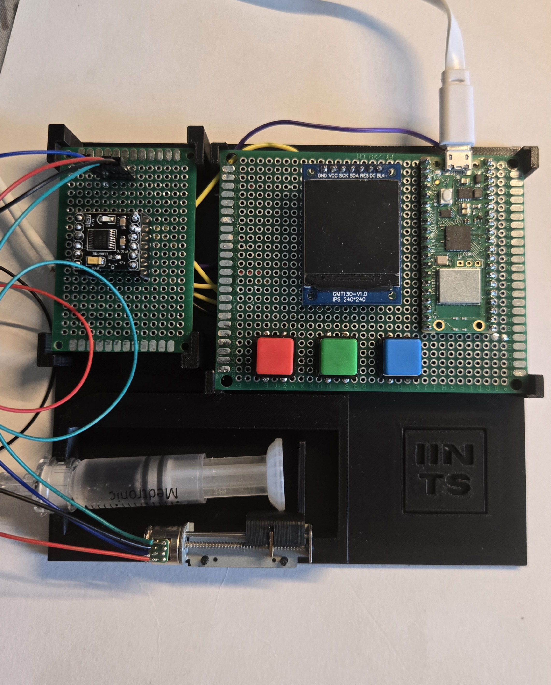

# IINTS – Open-Source Insulin Pump Prototype

<div align="center">
  
</div>

**IINTS** (*Insuline Is Not The Solution*) is an open-source educational insulin pump prototype built around the **Raspberry Pi Pico**.

The project started as an experiment to understand how insulin pumps work from an engineering perspective: how a motor can create precise linear movement, how that movement can be translated into fluid displacement, and how embedded software can control the complete mechanism.

The first generation of IINTS combines a **Raspberry Pi Pico**, a **stepper-driven syringe mechanism**, a display, physical controls, and a 3D-printed enclosure.

> **Important:** IINTS is an educational and research prototype.
> It is **not a medical device**, has not been clinically validated or certified, and must **not be used to administer insulin or any other medication to a person**.

## Project Generations

- **MK.1:** The original pump files remain in the repository root.
- **MK.2:** The second-generation firmware, Calm Mode, simulator, assets, and
  documentation are available in [`/mk2`](mk2/README.md).

---

## About the Project

I started IINTS in **2024** after becoming curious about the technology behind the insulin pumps I had been using for most of my life.

Instead of treating the pump as a closed box, I wanted to understand what was happening inside it:

* How does a pump physically move a small amount of fluid?
* How can a stepper motor be controlled accurately?
* How do mechanical dimensions influence displacement?
* How can an embedded user interface control the mechanism?
* What engineering challenges appear when combining electronics, software and mechanics into a small device?

IINTS became my way of exploring those questions by building a pump mechanism from scratch.

The project is published as open source so that others interested in **embedded systems, electronics, programming, 3D printing and medical technology** can study and experiment with the concepts behind it.

---

## Project History

### Milestones

* **May 2024** – First working prototype using a Raspberry Pi Pico
* **July 2024** – Added a display and user interface
* **December 2024** – Introduced microstepping experiments to improve motor control and mechanical resolution
* **April 2025** – Awarded **Most Technically Complex Project** at Coolest Projects Belgium
* **May 2025** – Named **Student in the Spotlight** for the third time, this time for IINTS
* **July 2025** – Ranked among the top 7% of applicants from more than 120 countries for the CERN Solvay Student Camp
* **August 2025** – Presented IINTS at the CIONET Summer Festival
* **October 2025** – Presented the project at HackYeah in Kraków, Poland

---

## Hardware Overview

The first-generation IINTS prototype consists of several main subsystems:

### Controller

* **Raspberry Pi Pico**
* RP2040 microcontroller
* Firmware written in **MicroPython**

The Pico controls the motor, display and physical user inputs.

### Motor System

A small stepper motor drives a threaded linear mechanism.

Rotational movement from the motor is converted into linear movement, which pushes the syringe plunger forward.

The motor is controlled through a dedicated motor driver.

### User Interface

The prototype includes:

* Display-based interface
* Physical push buttons
* Motor control
* Basic device status information

### Mechanical System

The mechanical assembly consists of:

* Stepper motor
* Threaded spindle / linear actuator
* Syringe holder
* Plunger mechanism
* 3D-printed mounting components
* 3D-printed enclosure

---

## How the Pump Mechanism Works

The basic mechanical principle is relatively simple.

A stepper motor rotates a threaded spindle. The spindle converts the rotational movement of the motor into linear movement.

That linear movement pushes the plunger of a syringe.

Because the dimensions of the syringe, spindle pitch and motor movement are known, the theoretical fluid displacement per motor revolution or motor step can be estimated.

### Volume per Revolution

For a syringe with internal radius \(r\) and a spindle with pitch \(p\):

$$
V_{rev} = \pi r^2 p
$$

where:

* \(V_{rev}\) = theoretical displaced volume per spindle revolution
* \(r\) = internal radius of the syringe
* \(p\) = linear spindle travel per revolution

### Volume per Motor Step

If the motor requires \(N_{steps}\) controlled steps for one revolution:

$$
V_{step} = \frac{V_{rev}}{N_{steps}}
$$

This provides a theoretical relationship between motor movement and syringe displacement.

These equations describe the **mechanical principle only**. Real systems are affected by factors such as backlash, friction, syringe tolerances, motor accuracy, compliance and assembly tolerances.

The calculations in this repository must therefore **not be interpreted as validated medication-delivery accuracy**.

---

## Features

### Raspberry Pi Pico Control

The device is controlled by an RP2040-based Raspberry Pi Pico running MicroPython.

### Stepper Motor Control

A stepper motor provides controlled mechanical movement of the syringe plunger.

### Display Interface

A small display provides a graphical interface for interacting with the prototype.

### Physical Controls

Push buttons allow the user to navigate the interface and control the demonstrator.

### 3D-Printed Mechanism

The enclosure and several mechanical components can be produced using a standard FDM 3D printer.

### Open Source

The firmware, mechanical designs and documentation are publicly available so that the project can be studied, modified and improved.

---

## Project Images

<table align="center">
  <tr>
    <td align="center">
      
    </td>
  </tr>
  <tr>
    <td align="center">
      First-generation IINTS prototype
    </td>
  </tr>
</table>

---

## Hardware

The exact hardware used has changed during development, but the prototype is built around the following components.

### Electronics

* **Raspberry Pi Pico (RP2040)**
* **TFT / graphical display**
* **Stepper motor**
* **Stepper motor driver**
* **Physical push buttons**
* **USB or battery-based power supply**

### Mechanical Components

* Syringe-based linear mechanism
* Threaded spindle / actuator
* Motor mount
* Syringe mount
* Plunger interface
* 3D-printed enclosure

> Different revisions of the prototype may use different components or wiring.
> Check the firmware and hardware files in the repository for the configuration corresponding to a specific revision.

---

## 3D Printing

The available 3D-printable components can be found in the [`/stl`](https://github.com/python35/IINTS/tree/main/stl) directory.

### Suggested Starting Settings

These settings were used as a general starting point during prototyping:

* **Material:** PLA or PETG
* **Layer height:** 0.2 mm
* **Infill:** approximately 20%
* **Bed adhesion:** skirt or brim where necessary
* **Supports:** dependent on part orientation

These are prototype settings rather than strict manufacturing specifications.

---

## 3D Printing Timelapses


---

## Software

The firmware is written in **MicroPython** and runs directly on the Raspberry Pi Pico.

### MicroPython Version

The original prototype was developed using:

**MicroPython v1.23.0 – 2024-06-02**

for the Raspberry Pi Pico.

MicroPython firmware for the Raspberry Pi Pico is available at:

https://micropython.org/download/RPI_PICO/

### Check the Installed Version

Connect to the MicroPython REPL and run:

```python
import os
print(os.uname())
```

---

## Development Environment

The original firmware was primarily developed using **Thonny**.

Thonny can be downloaded from:

https://thonny.org/

### Raspberry Pi Pico Setup

1. Connect the Raspberry Pi Pico to your computer.
2. Open Thonny.
3. Select the Raspberry Pi Pico / MicroPython interpreter.
4. Install MicroPython on the Pico if necessary.
5. Copy the required project files to the Pico.
6. Run the firmware.

---

## Clone the Repository

```bash
git clone https://github.com/python35/IINTS.git
cd IINTS
```

You can also download the repository as a ZIP file directly from GitHub.

---

## Repository Structure

The repository contains the different parts of the first-generation IINTS project, including firmware, assets and mechanical files.

For example:

```text
IINTS/
├── assets/
│   └── project images and media
│
├── stl/
│   └── 3D-printable components
│
├── main.py
│   └── main MicroPython firmware
│
└── README.md
```

The exact structure may change as the repository evolves.

---

## What This Project Is

IINTS is intended as:

* an educational embedded-systems project
* an exploration of insulin-pump mechanics
* an open-source hardware experiment
* a way to study stepper motor control
* a project for learning MicroPython
* an example of combining electronics, software and 3D printing
* a platform for discussing transparency in medical technology

---

## What This Project Is Not

IINTS is **not**:

* a certified insulin pump
* a replacement for a commercial insulin pump
* clinically validated
* intended for treatment decisions
* intended for administering medication
* a source of medical dosing advice
* suitable for human use

The project demonstrates engineering concepts only.

---

## Contributing

Contributions are welcome.

If you want to experiment with the project:

1. Fork the repository.
2. Create your own branch.
3. Make and document your changes.
4. Submit a Pull Request.

Improvements to the firmware, documentation, electronics, mechanical design and simulation tools are all welcome.

Please keep the educational and non-clinical nature of the project clear when contributing.

---

## License

This repository is licensed under the **MIT License**.

The license allows the source code and project files to be used, modified and redistributed under the terms of the MIT License.

The MIT License does **not** imply that the hardware or software is safe, clinically validated, medically approved or suitable for use as a medical device.

---

## Safety Disclaimer

**IINTS is an experimental educational prototype.**

The hardware, firmware, mechanical components and calculations in this repository have **not been designed, tested, validated or certified for clinical use**.

Do not connect this prototype to a person and do not use it to administer insulin, medication or other substances.

Commercial insulin pumps are safety-critical medical devices that require extensive engineering controls, verification, validation, risk management, manufacturing controls and regulatory approval. This project does not provide those guarantees.

Use the repository only for **education, research and engineering experimentation**.

---

## Special Thanks

A special thank you to the **coaches of CoderDojo Genk and Hasselt** for their guidance and support throughout the development of IINTS.

Their feedback and mentorship helped turn an early experiment into a much larger engineering and educational project.

---

## Related Development

This repository documents the **original hardware-focused generation of IINTS**.

The project has since grown beyond the physical pump prototype into broader research and educational work around diabetes technology, simulation, algorithmic safety and transparent medical technology.

The original pump remains an important part of that story: it was the starting point for understanding what happens between a line of software and the physical movement of a medical device.
