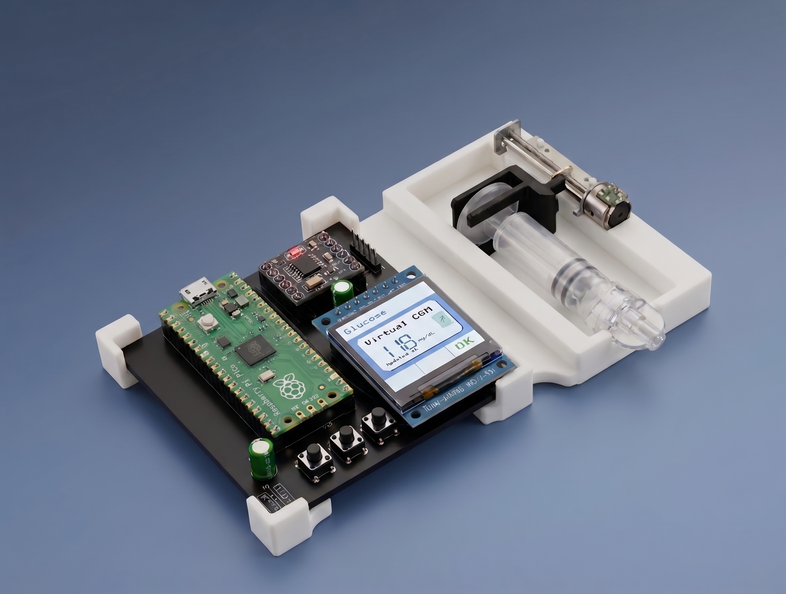
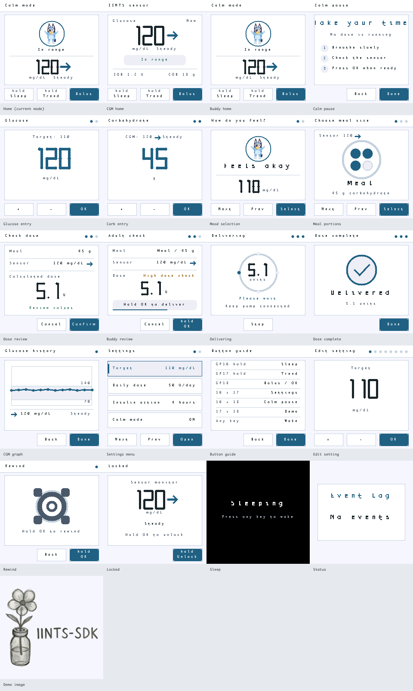

<h1 align="center">IINTS MK2</h1>

<p align="center">
  <strong>Open, neuro-inclusive insulin pump research platform</strong><br>
  <sub>Firmware, hardware, interface research, and an electromechanical prototype built around Raspberry Pi Pico.</sub>
</p>

<p align="center">
  
</p>

<p align="center">
  <a href="mk2/README.md"><strong>Documentation</strong></a>
  &nbsp;&middot;&nbsp;
  <a href="mk2/firmware/">Firmware</a>
  &nbsp;&middot;&nbsp;
  <a href="mk2/simulator/">UI Simulator</a>
  &nbsp;&middot;&nbsp;
  <a href="mk2/hardware/pcb-v2/">PCB V2</a>
</p>

<p align="center">
  <sub>Viewing the <code>mk2</code> branch. Looking for the <a href="https://github.com/python35/IINTS/tree/mk1">original MK1</a>?</sub>
</p>

> [!CAUTION]
> **Research prototype only.** IINTS MK2 is not a certified medical device and
> must not be used for treatment decisions or to deliver insulin to a person.

## Project Overview

IINTS MK2 is the second generation of the IINTS project. It brings the pump
mechanism, embedded interface, virtual glucose sensor, and development tools
together in one transparent open source research platform.

- **Research focus:** pump mechanics, embedded UI, and neuro-inclusive
  interaction.
- **Hardware:** Raspberry Pi Pico, ST7789 IPS display, DRV8833, bipolar
  stepper, lead screw, and test syringe.
- **Interface:** three physical buttons with Standard Mode and low-sensory
  Calm Mode.
- **Glucose model:** virtual CGM in `mg/dL`, updated every 60 seconds.
- **Development:** MicroPython firmware, Pico deploy package, desktop UI
  simulator, and editable KiCad V2 sources.
- **Status:** working educational prototype; PCB V2 remains a design draft.

## Research Goals

MK2 explores two questions together:

1. How can an embedded pump mechanism, user interface, and educational dosing
   model be built transparently from open source components?
2. How can the interaction be calmer and easier to follow for children and
   neurodivergent users without hiding clinically relevant information?

The current interface is in English and uses glucose values in `mg/dL`. The
complete source and documentation are kept under [`mk2/`](mk2/README.md).

## Main Features

- virtual CGM updates every minute with rising, steady, and falling trends;
- Standard Mode with glucose, IOB, COB, carbohydrate, and dose information;
- low-sensory **Calm Mode** with one decision per screen;
- guided meal-size and bolus flow;
- separate Adult Check with a deliberate hold before motor movement;
- glucose history, settings, button guide, manual rewind, and Calm Pause;
- automatic lock and power-saving sleep;
- delivery animation and flashing onboard LED while the motor runs;
- cancellable motor movement with completed-step tracking;
- desktop simulator that runs the real firmware drawing functions;
- published MicroPython source, deploy package, project report, UI assets,
  controller photograph, and editable KiCad V2 design files.

## Open Project Files

| Area | Files |
| --- | --- |
| Complete MK2 documentation | [`mk2/README.md`](mk2/README.md) |
| Canonical MicroPython firmware | [`mk2/firmware/pico_drv8833_correct_pins.py`](mk2/firmware/pico_drv8833_correct_pins.py) |
| Ready-to-upload Pico filesystem | [`mk2/firmware/deploy/`](mk2/firmware/deploy/) |
| Desktop UI simulator | [`mk2/simulator/`](mk2/simulator/) |
| Complete UI overview | [`mk2/simulator/previews/current-ui-overview.png`](mk2/simulator/previews/current-ui-overview.png) |
| PCB V2 KiCad source | [`mk2/hardware/pcb-v2/`](mk2/hardware/pcb-v2/) |
| MK2 controller photograph | [`mk2/assets/hardware/`](mk2/assets/hardware/) |
| Calm Mode documentation | [`mk2/docs/NEURODIVERGENT_MODE.md`](mk2/docs/NEURODIVERGENT_MODE.md) |
| UI simulator guide | [`mk2/docs/UI_SIMULATOR.md`](mk2/docs/UI_SIMULATOR.md) |
| Project report | [`mk2/docs/IINTS-MK2.pdf`](mk2/docs/IINTS-MK2.pdf) |

## Repository Structure

```text
mk2/
|-- README.md                         # Complete MK2 documentation
|-- assets/
|   |-- branding/                     # IINTS branding and startup preview
|   |-- bluey/                        # Calm Mode assets and rights notice
|   `-- hardware/                     # MK2 controller photograph
|-- docs/                             # Project report and focused guides
|-- firmware/
|   |-- pico_drv8833_correct_pins.py  # Readable source of truth
|   |-- st7789.py                     # Display driver
|   `-- deploy/                       # Ready-to-copy Pico files
|-- hardware/
|   `-- pcb-v2/                       # Editable KiCad 9 design source
|-- simulator/                        # Desktop UI simulator and previews
|-- tools/                            # Asset preparation and hardware tests
`-- requirements.txt                  # Desktop development dependencies
```

Some first-generation files remain in the repository history and root for
traceability. The maintained MK2 project lives under `mk2/`.

## Neuro-Inclusive Calm Mode

Calm Mode keeps the glucose value and trend visible while reducing the amount
of information presented at once. It uses:

- predictable screen structure;
- muted colours and dark readable text;
- written labels in addition to colour and arrows;
- a small buddy image that does not cover the glucose value;
- five consistent meal portions;
- an adult review before motor movement;
- a pause screen with three short, ordered steps;
- optional animations.

This is a research design direction, not a formally certified accessibility or
medical-usability claim.

<details>
<summary><strong>View all current MK2 screens</strong></summary>



</details>

## Hardware And PCB V2

The photographed prototype uses a Raspberry Pi Pico, ST7789 display, three
buttons, and a DRV8833 motor-driver module. The firmware GPIO mapping is fully
documented in the [technical MK2 README](mk2/README.md#wiring).

The supplied KiCad project is published openly under
[`mk2/hardware/pcb-v2/`](mk2/hardware/pcb-v2/). It contains the project,
hierarchical schematics, and an early PCB placement file.

> [!WARNING]
> The KiCad PCB is an early design study. It still contains generic placeholder
> footprints, is not routed, and does not match the photographed Pico board
> one-to-one. It is not ready for fabrication. Read the
> [PCB status notes](mk2/hardware/pcb-v2/README.md) before reusing it.

Gerbers, drill files, BOM, and pick-and-place files are intentionally not
present because no reviewed manufacturing release exists yet.

## Run The UI Simulator

The simulator does not connect to the Pico and cannot move the motor:

```bash
git clone https://github.com/python35/IINTS.git
cd IINTS
git switch mk2
cd mk2

python3 -m venv .venv
source .venv/bin/activate
python -m pip install -r requirements.txt
python simulator/ui_simulator.py
```

On macOS, `mk2/simulator/Open UI Simulator.command` starts the same interface.

## Deploy To A Pico

The low-memory runtime files are already collected in
[`mk2/firmware/deploy/`](mk2/firmware/deploy/):

```text
main.py
pico_app.mpy
st7789.py
start.raw
happy_calm.raw
sad_calm.raw
angry_calm.raw
```

Back up the Pico first, then upload those seven runtime files to its filesystem
root with Thonny or `mpremote`. The compiled `.mpy` format must match the
MicroPython version installed on the Pico. Full build and upload commands are
in the [technical README](mk2/README.md#build-the-pico-application).

## Educational Model

The active demonstration path includes:

- `ICR = 500 / TDD`;
- `ISF = 1800 / TDD`;
- a simplified quadratic IOB decay model;
- linear COB decay over three or six hours;
- meal and correction components with IOB/COB compensation;
- a `70 mg/dL` low-glucose lockout;
- a `15.0 U` single-bolus software limit;
- a volatile 24-hour limit of `2 x TDD`;
- motor conversion based on assumed reservoir and lead-screw geometry.

Experimental PID, predictive-low-glucose, and sensor-noise helpers exist in the
source but are not connected to the active motor-delivery loop. MK2 must not be
presented as a validated closed-loop artificial pancreas.

## Current Limitations

- virtual CGM only;
- no validated basal or closed-loop controller;
- no persistent settings, dose log, or event log;
- no occlusion, reservoir, battery, current, or position sensing;
- no redundant processor or independent motor cutoff;
- unfinished PCB V2 layout and no manufacturing package;
- no formal medical-device, electrical-safety, usability, or clinical
  validation.

## License And Artwork

Original source code, KiCad files, and documentation are published under the
repository's [MIT License](LICENSE).

The optional Bluey buddy images are third-party artwork and are not covered by
the MIT License. IINTS is not affiliated with or endorsed by the relevant
rights holders. See the [asset notice](mk2/assets/bluey/README.md).

## Author

Developed by **Rune Bobbaers** as part of the **IINTS** research project.
