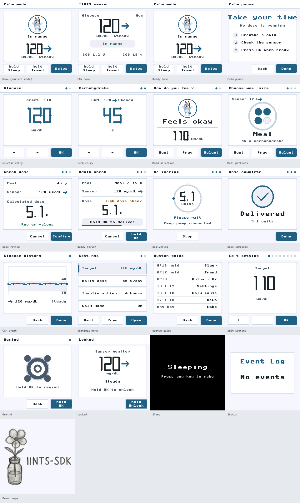

# IINTS MK.2

IINTS MK.2 is the second-generation Raspberry Pi Pico research prototype. It
combines the pump controller, a 240x240 ST7789 interface, a simulated CGM,
power management, and an optional Calm Mode designed to reduce cognitive and
sensory load.

> **Research prototype only.** This project is not a certified medical device.
> Test the software with insulin disconnected and under qualified supervision.



## Highlights

- Clear 240x240 interface using the native MicroPython 8x8 font.
- Simulated CGM updates with mg/dL values, trend arrows, and glucose history.
- Guided meal and bolus flow with a separate confirmation before delivery.
- IOB and COB research models without hiding the calculated values.
- Calm Mode with predictable screens, low-sensory colours, meal portions, and
  a small Bluey buddy while keeping the glucose value visible.
- Settings, button guide, graph, rewind, lock screen, and automatic sleep.
- Delivery animation, physical stop action, and flashing Pico LED while the
  motor is active.
- Desktop simulator that executes the real firmware drawing functions without
  connecting to or moving the pump.

## Repository Layout

```text
mk2/
|-- firmware/
|   |-- pico_drv8833_correct_pins.py   # Canonical MicroPython source
|   |-- st7789.py                       # Display driver
|   `-- deploy/                         # Ready-to-copy Pico filesystem
|-- simulator/                          # Safe desktop UI simulator
|-- assets/                             # Branding and Calm Mode assets
|-- docs/                               # UI guide and project report
`-- tools/                              # Asset and hardware test utilities
```

## Definitive Pin Mapping

### Pico to DRV8833

| Pico | DRV8833 |
| --- | --- |
| Pin 40 / 3V3 | VCC |
| Pin 38 / GND | GND |
| Pin 36 / GP28 | EEP |
| GP4 | IN1 |
| GP5 | IN2 |
| GP6 | IN3 |
| GP9 | IN4 |

DRV8833 `OUT1/OUT2` connect to Motor A and `OUT3/OUT4` connect to Motor B.
Battery positive connects to `VM`. Battery negative and every device ground
must share the same GND.

### Display and Buttons

| Device signal | Pico |
| --- | --- |
| Display SCK | GP10 |
| Display SDA | GP11 |
| Display RES | GP12 |
| Display DC | GP13 |
| Display VCC / BLK | 3V3 |
| Button 1 | GP16 to GND |
| Button 2 | GP17 to GND |
| Button 3 | GP18 to GND |

## Run the Safe UI Simulator

The simulator never connects to the Pico and cannot move the motor.

```bash
cd mk2
python3 -m venv .venv
source .venv/bin/activate
pip install -r requirements.txt
cd simulator
python3 ui_simulator.py
```

The macOS launcher `simulator/Open UI Simulator.command` provides the same
interface. See [the simulator guide](docs/UI_SIMULATOR.md) for all controls.

## Build the Pico Application

The included `firmware/deploy/pico_app.mpy` was tested with MicroPython 1.28.0
on a Raspberry Pi Pico. The Python source remains the canonical version.

```bash
cd mk2
mpy-cross -o firmware/deploy/pico_app.mpy \
  firmware/pico_drv8833_correct_pins.py
```

## Deploy to a Pico

Back up the Pico filesystem before replacing files. With `mpremote` installed:

```bash
cd mk2
mpremote connect auto fs cp \
  firmware/deploy/main.py \
  firmware/deploy/pico_app.mpy \
  firmware/deploy/st7789.py \
  firmware/deploy/*.raw :
mpremote connect auto reset
```

The deploy folder contains `main.py`, the compiled application, the ST7789
driver, the startup image, and all three Calm Mode images. Its explanatory
`README.md` does not need to be copied to the Pico.

## Controls

- `GP16`: increase or select the next option.
- `GP17`: decrease, go back, cancel, or stop delivery.
- `GP18`: select, confirm, or continue.
- Hold `GP16`: enter power-saving sleep.
- Hold `GP17`: open glucose history.
- Hold `GP16 + GP17`: open Settings.
- Hold `GP16 + GP18`: open Calm Pause in Calm Mode.
- Hold `GP17 + GP18`: show the project image.
- Press any button to wake the display.

The complete legend remains available in
[the Calm Mode guide](docs/NEURODIVERGENT_MODE.md) and on the pump under
`Settings > Button guide`.

## Bluey Asset Note

The Bluey images are retained as part of this prototype's Calm Mode concept at
the project author's request. Bluey is a third-party character. This project is
not affiliated with or endorsed by the character's rights holders. See the
[asset notice](assets/bluey/README.md) for licensing scope.
