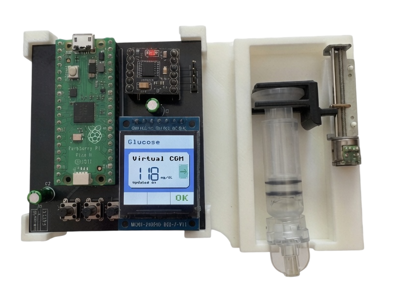
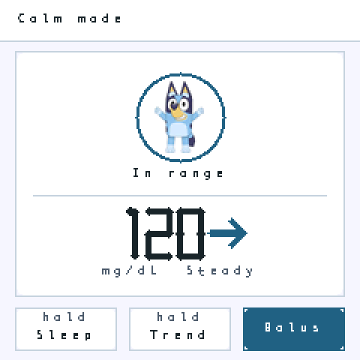

# IINTS MK2

**Neuro-inclusive insulin pump simulator, open hardware study, and
electromechanical demonstrator**

[Back to the main IINTS repository](../README.md)

This README describes the **IINTS MK2 only**. The MK1 has different hardware,
wiring, firmware, and interaction patterns.

> [!CAUTION]
> **Research and education prototype only.** IINTS MK2 is not a certified
> medical device and must not be used to make treatment decisions or deliver
> insulin to a person. Test the mechanism disconnected from a person and use
> water or another harmless test liquid. The calculations and safety checks are
> demonstrations, not a substitute for validated pump firmware or clinical
> supervision.

<table>
  <tr>
    <td width="50%" align="center">
      
    </td>
    <td width="50%" align="center">
      
    </td>
  </tr>
  <tr>
    <td align="center"><strong>Complete MK2 prototype</strong></td>
    <td align="center"><strong>Calm Mode interface</strong></td>
  </tr>
</table>

## Quick Links

| Area | Open files |
| --- | --- |
| Firmware source | [`firmware/pico_drv8833_correct_pins.py`](firmware/pico_drv8833_correct_pins.py) |
| Ready-to-upload Pico build | [`firmware/deploy/`](firmware/deploy/) |
| PCB V2 KiCad project | [`hardware/pcb-v2/`](hardware/pcb-v2/) |
| Desktop UI simulator | [`simulator/`](simulator/) |
| Complete UI overview | [`simulator/previews/current-ui-overview.png`](simulator/previews/current-ui-overview.png) |
| Calm Mode documentation | [`docs/NEURODIVERGENT_MODE.md`](docs/NEURODIVERGENT_MODE.md) |
| Simulator guide | [`docs/UI_SIMULATOR.md`](docs/UI_SIMULATOR.md) |
| MK2 project report | [`docs/IINTS-MK2.pdf`](docs/IINTS-MK2.pdf) |

## Overview

IINTS MK2 combines a Raspberry Pi Pico, a custom controller PCB/prototype
board, a 240 x 240 ST7789 IPS display, three physical buttons, a DRV8833 motor
driver, and a bipolar stepper motor. The prototype demonstrates:

- a virtual CGM value in `mg/dL`, refreshed once per minute;
- a visible rising, steady, or falling trend;
- standard and low-sensory **Calm Mode** interfaces;
- a guided carbohydrate and bolus flow;
- a separate adult confirmation before motor movement;
- educational IOB, COB, correction, and meal-dose calculations;
- a delivery animation and flashing onboard LED while the motor runs;
- glucose history, settings, manual rewind, screen locking, and power saving;
- a desktop simulator that previews the real firmware drawing functions;
- open MicroPython firmware, deployment files, documentation, assets, and
  editable KiCad design source.

The current firmware interface is in English.

## What Is New In MK2

Compared with the original concept, MK2 is built around a complete three-button
workflow and a full-colour IPS interface. Its main additions are the virtual CGM,
trend history, Calm Mode, visual meal portions, adult hand-off, runtime settings,
manual rewind, delivery feedback, and automatic sleep.

The desktop UI simulator is part of the MK2 workflow. It allows the 240 x 240
screens to be reviewed before anything is uploaded to the Pico.

## Project Status

| Part | Status |
| --- | --- |
| MicroPython firmware source | Published and used by the current prototype |
| Compiled Pico deployment package | Published in `firmware/deploy/` |
| Desktop UI simulator | Published and usable without a Pico |
| Calm Mode and buddy assets | Published with a separate artwork notice |
| MK2 controller photograph | Published in `assets/hardware/` |
| KiCad schematic source | Published as an editable V2 design draft |
| KiCad PCB layout | Early placeholder; not fabrication-ready |
| Gerbers, drill files, BOM, pick-and-place | Not released because the PCB design is unfinished |
| Medical or clinical validation | Not performed |

Publishing a source file does not make it a finished manufacturing release.
The exact PCB status is documented in the
[PCB V2 design notes](hardware/pcb-v2/README.md).

## User Interface

### Standard mode

Standard mode keeps the clinical data visible. The home screen shows the current
virtual sensor value, its direction, IOB, and COB. The bolus flow then asks for
carbohydrates, shows the calculated dose, and requires confirmation before the
motor can start.

### Calm Mode

Calm Mode reduces the number of decisions and visual elements shown at once:

- one primary task per screen;
- a fixed header, content area, and three-button footer;
- a cool-white background, dark text, and one muted-blue focus colour;
- written status labels in addition to colour and symbols;
- a small buddy image that supports, but never replaces, the glucose value;
- five predictable meal portions: `0`, `15`, `30`, `45`, and `60 g`;
- a dedicated Adult Check with a deliberate `1.4 s` hold;
- Calm Pause, which stops motor output and shows three short steps.

The UI is intended to reduce sensory and cognitive load. It has not undergone a
formal accessibility or medical usability certification.

<details>
<summary><strong>View the complete current 240 x 240 UI overview</strong></summary>


</details>

## Hardware

| Component | MK2 role |
| --- | --- |
| Raspberry Pi Pico or Pico W | Runs MicroPython, calculations, UI, and motor state machine |
| 240 x 240 ST7789 IPS display | Main interface over SPI1 |
| DRV8833 dual H-bridge | Drives the bipolar stepper motor |
| Bipolar stepper motor | Demonstrates plunger movement |
| Lead screw and test reservoir | Converts rotation into linear movement |
| Three active-low push buttons | Previous/down, next/up, and OK |
| External motor battery/supply | Powers `VM` on the motor driver |

The motor calculation currently assumes a 200-step motor, a `0.5 mm` lead-screw
pitch, and a `9.5 mm` reservoir inner diameter. Real hardware must be measured
and calibrated before its movement can be interpreted as a volume.

## Open PCB V2 Design

The complete supplied KiCad V2 source is available in
[`hardware/pcb-v2/`](hardware/pcb-v2/). Open
[`ai_pomp.kicad_pro`](hardware/pcb-v2/ai_pomp.kicad_pro) with **KiCad 9**.

The directory includes the project, root schematic, hierarchical schematic
sheets for USB-C, the display, controller pins, motor driver, and buttons, plus
the early PCB placement file. Temporary locks, autosaves, and backup archives
are deliberately excluded because Git provides the version history.

> [!WARNING]
> The supplied KiCad files are an early V2 design study. The PCB file still
> contains generic placeholder footprints and is not routed or ready to order.
> It does not yet match the photographed Pico-based controller one-to-one. Read
> the [PCB design notes](hardware/pcb-v2/README.md) before reusing it.

This distinction keeps the full design history public without presenting an
unfinished board as validated hardware.

## Wiring

The GPIO names below are the source of truth for the firmware. Physical pin
numbers refer to a standard 40-pin Raspberry Pi Pico/Pico W.

### Pico to DRV8833

| Pico GPIO | Physical pin | DRV8833 |
| --- | ---: | --- |
| `GP4` | 6 | `IN1` |
| `GP5` | 7 | `IN2` |
| `GP6` | 9 | `IN3` |
| `GP9` | 12 | `IN4` |
| `GP28` | 34 | `EEP` / enable |
| `3V3(OUT)` | 36 | Logic `VCC`, if present on the module |
| `GND` | 38 | `GND` |

### DRV8833 to motor

| DRV8833 | Motor |
| --- | --- |
| `OUT1` | Coil A+ |
| `OUT2` | Coil A- |
| `OUT3` | Coil B+ |
| `OUT4` | Coil B- |

If the motor only vibrates, verify the two coil pairs before changing the
firmware sequence.

### Display to Pico

| Display | Pico GPIO | Physical pin |
| --- | --- | ---: |
| `GND` | `GND` | Any Pico GND |
| `VCC` | `3V3(OUT)` | 36 |
| `SCK` | `GP10` | 14 |
| `SDA` / `MOSI` | `GP11` | 15 |
| `RES` | `GP12` | 16 |
| `DC` | `GP13` | 17 |
| `BLK` | `3V3(OUT)` | 36 |

`BLK` is connected directly to 3.3 V, so the current firmware cannot dim the
backlight with PWM.

### Buttons

| Button | Pico GPIO | Physical pin | Other side |
| --- | --- | ---: | --- |
| Button 1 | `GP16` | 21 | `GND` |
| Button 2 | `GP17` | 22 | `GND` |
| Button 3 | `GP18` | 24 | `GND` |

The firmware enables the Pico's internal pull-up resistors. A pressed button
therefore reads `LOW`.

### Power

- Battery positive goes to DRV8833 `VM`.
- Battery negative goes to the common ground.
- Pico GND, DRV8833 GND, battery negative, display GND, and button GND must be
  connected together.
- Do not power the motor from the Pico's 3.3 V output.
- On a standard Pico, physical pin **36** is `3V3(OUT)`. Physical pin **40** is
  `VBUS`, not 3.3 V. Verify the exact board and driver-module pinout before
  applying power.

See the [official Raspberry Pi Pico documentation](https://www.raspberrypi.com/documentation/microcontrollers/pico-series.html)
for the board pinout.

## Complete Control Legend

| Input | Normal action |
| --- | --- |
| `GP16` | Next, increase, or move upward |
| `GP17` | Previous, decrease, back, cancel, or stop delivery |
| `GP18` | Select, OK, confirm, or continue |

Values repeat automatically while `GP16` or `GP17` is held. Repeating becomes
faster after approximately `0.9 s` and faster again after `2.2 s`.

| Hold or combination | Action |
| --- | --- |
| Hold `GP16` for `2.5 s` on Home | Enter power-saving sleep |
| Hold `GP17` for `0.9 s` on Home | Open glucose history |
| Hold `GP18` during Adult Check | Confirm delivery after `1.4 s` |
| Hold `GP18` in Rewind | Run the motor backwards only while held |
| Hold `GP16 + GP17` for `0.7 s` | Open or close Settings |
| Hold `GP16 + GP18` for `0.7 s` in Calm Mode | Open Calm Pause |
| Hold `GP17 + GP18` for `0.7 s` | Show or close the project image/demo |
| Press any button while sleeping | Wake the display and driver |

The same legend is available on the device under `Settings > Button guide`.

## Guided Bolus Flow

With the default virtual CGM and Calm Mode enabled:

1. Home shows the current sensor value and trend.
2. Press `GP18` to start a bolus.
3. Select one of the five meal portions.
4. Review the meal, sensor value, trend, and calculated dose.
5. Continue to Adult Check.
6. An adult holds `GP18` for `1.4 s` to authorize motor movement.
7. During delivery, an hourglass-style animation is shown and the onboard Pico
   LED flashes.
8. Press `GP17` to stop delivery early.
9. A quiet checkmark confirms completion.

In Standard mode, carbohydrates can be changed in grams. Holding a value button
accelerates the adjustment.

## Settings

Open Settings by holding `GP16 + GP17` for `0.7 s`.

| Setting | Default | Range or action |
| --- | ---: | --- |
| Target | `110 mg/dL` | `80-180 mg/dL` |
| Daily dose (TDD) | `50 U/day` | `10-100 U/day` |
| Insulin action (DIA) | `4 h` | `2-8 h` |
| Calm Mode | On | On/off |
| CGM sensor simulation | On | On/off |
| Animations | On | On/off |
| Rewind | - | Hold `GP18` to reverse motor movement |
| Button guide | - | Opens the complete onboard legend |

Settings currently live in RAM only. Restarting the Pico restores the defaults
defined in `pico_drv8833_correct_pins.py`.

## Active Educational Model

The following calculations are active in the current bolus path.

### Patient factors

Using total daily dose `TDD`:

```text
ICR = 500 / TDD       grams per unit
ISF = 1800 / TDD      mg/dL per unit
```

At the default `TDD = 50 U/day`, this gives `ICR = 10 g/U` and
`ISF = 36 mg/dL/U`.

### Insulin on board

For each logged dose still inside the configured duration of insulin action:

```text
remaining IOB = dose * (1 - elapsed / DIA)^2
```

This is a simplified quadratic demonstration model. It must not be presented as
a validated patient-specific pharmacokinetic model.

### Carbohydrates on board

COB decreases linearly over `3 h` for standard portions and `6 h` for the
largest meal portion.

### Bolus calculation

```text
meal dose       = carbohydrates / ICR
correction dose = (current BG - target BG) / ISF
protected IOB   = max(0, IOB - COB / ICR)
bolus           = max(0, meal dose + correction dose - protected IOB)
```

The result is then limited by the educational guardrails below.

### Motor conversion

The current assumptions are:

```text
reservoir radius       = 4.75 mm
lead-screw pitch       = 0.5 mm/revolution
stepper resolution     = 200 steps/revolution
U-100 reference volume = 10 microlitres/unit
calculated output      = 3.544 units/revolution
calculated resolution  = 56.43 steps/unit
```

These values describe the software model, not a calibration certificate for the
physical prototype.

## Educational Guardrails

| Check | Current behaviour |
| --- | --- |
| Low-glucose lockout | A calculated bolus is blocked at or below `70 mg/dL` |
| Single-bolus limit | Requested dose is clamped to `15.0 U` |
| Rolling dose limit | Logged delivery since boot is limited to `2 x TDD` over 24 hours |
| Adult hand-off | Calm Mode requires a continuous `1.4 s` hold before delivery |
| Delivery cancel | `GP17` stops the motor and records only completed steps |
| Motor shutdown | All four driver inputs are set low after movement |

These safeguards are implemented for demonstration and have not been validated
to medical-device standards. The injection and carbohydrate logs are volatile;
they are lost when power is removed.

The source also contains experimental PID basal, predictive-low-glucose, and
sensor-noise helper functions. They are **not connected to the current main
delivery loop** and should not be described as active closed-loop control.

## Virtual CGM

The MK2 does not currently communicate with a physical glucose sensor. The
default demo cycles through this sequence once per minute:

```text
118, 124, 132, 145, 158, 151, 138, 126, 113, 101, 108, 116 mg/dL
```

The trend is rising for a change of at least `+5 mg/dL`, falling for a change of
at most `-5 mg/dL`, and steady otherwise. Up to 24 samples are kept in RAM for
the history graph.

## Locking And Power Saving

- Home locks after `30 s` without input while the virtual CGM is active.
- The display and driver enter sleep after `180 s` without input.
- Holding `GP16` for `2.5 s` enters sleep immediately.
- Sleep disables the motor, turns off the delivery LED, lowers the driver enable
  pin, sends the ST7789 sleep command, and uses Pico light sleep where available.
- Any button wakes the prototype.

Because `BLK` is wired directly to 3.3 V, actual backlight power depends on the
display module. For maximum battery saving, route `BLK` through a suitable GPIO
or transistor in a future hardware revision.

## Repository Layout

```text
mk2/
|-- README.md                         # This GitHub start page
|-- assets/
|   |-- branding/                     # IINTS logo and startup preview
|   |-- bluey/                        # Source, generated assets, and rights note
|   `-- hardware/                     # MK2 controller photograph
|-- docs/                             # Project report and focused guides
|-- firmware/
|   |-- pico_drv8833_correct_pins.py  # Canonical readable firmware
|   |-- st7789.py                     # Display driver
|   `-- deploy/                       # Ready-to-copy Pico filesystem
|-- hardware/
|   `-- pcb-v2/                       # Editable KiCad 9 V2 design source
|-- simulator/                        # Safe desktop UI simulator and previews
|-- tools/                            # Asset preparation and button tests
`-- requirements.txt                  # Desktop development dependencies
```

Only `happy_calm.raw`, `sad_calm.raw`, and `angry_calm.raw` are used by the
current buddy interface. Old food-image and startup-video experiments are not
part of the deployed MK2 package.

## Preview The UI

The simulator needs Python 3 and Tkinter, but no connected Pico:

```bash
cd mk2
python3 -m venv .venv
source .venv/bin/activate
python -m pip install -r requirements.txt
python simulator/ui_simulator.py
```

On macOS, double-click `simulator/Open UI Simulator.command`. The simulator can
preview individual screens, emulate all three buttons, auto-reload UI changes,
save screenshots, and export a complete contact sheet.

Generate a contact sheet from the command line with:

```bash
python simulator/ui_simulator.py \
  --contact-sheet simulator/previews/all-screens.png
```

The simulator replaces GPIO, SPI, timing, and motor access with desktop stubs.
It validates layout and interaction screens, not physical delivery behaviour.

See the [simulator guide](docs/UI_SIMULATOR.md) for the full workflow.

## Build The Pico Application

Install a current MicroPython build for the exact Pico model and confirm that a
REPL is available. Then create the development environment:

```bash
cd mk2
python3 -m venv .venv
source .venv/bin/activate
python -m pip install -r requirements.txt
```

Compile the large source file before copying it to the Pico:

```bash
mpy-cross \
  -o firmware/deploy/pico_app.mpy \
  firmware/pico_drv8833_correct_pins.py
```

The `mpy-cross` format must be compatible with the MicroPython firmware on the
Pico. An incompatible build raises `ValueError: incompatible .mpy file`. See
the [official MicroPython `.mpy` documentation](https://docs.micropython.org/en/latest/reference/mpyfiles.html).

The included deploy build is documented as tested with MicroPython 1.28.0.
Rebuild it whenever the Pico firmware or readable source changes.

## Deploy To A Pico

Back up the Pico filesystem first. The ready-to-copy directory contains:

```text
firmware/deploy/
|-- main.py
|-- pico_app.mpy
|-- st7789.py
|-- start.raw
|-- happy_calm.raw
|-- sad_calm.raw
`-- angry_calm.raw
```

With the development environment active and the Pico connected:

```bash
mpremote connect auto fs cp \
  firmware/deploy/main.py \
  firmware/deploy/pico_app.mpy \
  firmware/deploy/st7789.py \
  firmware/deploy/start.raw \
  firmware/deploy/happy_calm.raw \
  firmware/deploy/sad_calm.raw \
  firmware/deploy/angry_calm.raw :

mpremote connect auto reset
```

The deployment `main.py` imports only `pico_app.mpy`. This avoids compiling the
large readable firmware source on the Pico and reduces the chance of
`MemoryError`. The explanatory `firmware/deploy/README.md` is not needed on the
device.

The same files can be uploaded with Thonny. Place all seven runtime files in the
Pico filesystem root and restart the board.

## Troubleshooting

### `ImportError: no module named 'st7789'`

Upload `firmware/deploy/st7789.py` to the Pico root next to `pico_app.mpy`.

### `MemoryError`

- Use `firmware/deploy/pico_app.mpy` with the minimal deployment `main.py`.
- Remove the large `.py` application source from the Pico after compiling it.
- Remove obsolete video frames, food photos, and unused raw assets.
- Keep the three 64 x 64 buddy files streamed from flash; do not load a full
  image into RAM.

### `ValueError: incompatible .mpy file`

Recompile with an `mpy-cross` release that matches the MicroPython firmware on
the Pico.

### Buttons do not respond

- Confirm that each button connects its GPIO to common GND when pressed.
- Run `tools/test_buttons.py` or `tools/scan_buttons_safe.py` first.
- Check `GP16`, `GP17`, and `GP18`; the inputs are active low.
- Release all buttons before testing a two-button hold.

### The motor vibrates but does not rotate

Identify the two motor coils with a multimeter and connect each complete coil to
one DRV8833 output pair. Also verify `VM`, common ground, and `GP28` enable.

### Buddy images are missing

The UI falls back to a geometric face if an image cannot be opened. Confirm the
exact filenames in the Pico filesystem root:

```text
happy_calm.raw
sad_calm.raw
angry_calm.raw
```

## Suggested Test Order

1. Review every screen in `simulator/ui_simulator.py`.
2. Test the three buttons with the motor supply disconnected.
3. Confirm display colours, labels, sleep, wake, Settings, and button combos.
4. Test motor direction without a reservoir attached.
5. Calibrate mechanical travel with a ruler or dial indicator.
6. Test repeatability with water and a precision scale.
7. Record the firmware version, measured geometry, supply voltage, and results.

Do not proceed from bench testing to human use. A real insulin pump requires a
validated risk-management process, redundant fault detection, verified dosing,
biocompatible fluid paths, alarms, persistent records, cybersecurity controls,
and regulatory approval that this prototype does not provide.

## Current Limitations

- virtual CGM only; no Bluetooth or physical sensor connection;
- no active basal-delivery schedule or validated closed-loop controller;
- no non-volatile settings, dose history, or event log;
- no occlusion, reservoir, battery-voltage, current, or motor-position sensor;
- no redundant processor or independent motor cutoff;
- unfinished PCB V2 design with no released manufacturing package;
- no MK2-specific enclosure CAD in this directory;
- no formal IEC 62304, ISO 14971, IEC 62366, electrical-safety, or clinical
  validation.

These limitations are intentionally explicit so the MK2 can be presented
accurately as a research demonstrator.

## License And Artwork

The original source code, KiCad files, and project documentation are published
under the repository's [MIT License](../LICENSE).

The optional Bluey buddy artwork is third-party material and is **not** covered
by the MIT License. All rights to that artwork remain with the relevant rights
holders. IINTS is not affiliated with or endorsed by them. See the
[Bluey asset notice](assets/bluey/README.md) for details.

## Author

Developed by **Rune Bobbaers** as part of the **IINTS** research project.
